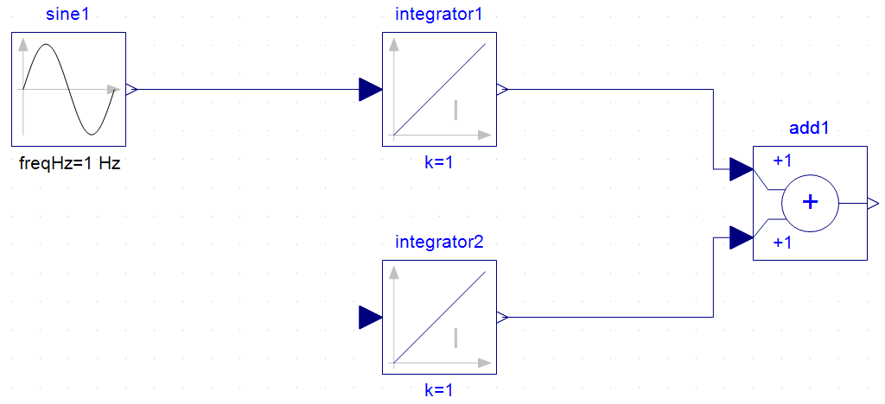

# FMU execution with pyFMI

The execute_FMU.py script contains a minimal example of how to run FMU within a
python script. The FMU is from type Co-Simulation and exported as a FMU v.2.0

The model of the included model can be seen here:

The predefined simulation parameter can be seen in extracted FMU (A FMU can be
  extracted like a .rar or .zip file) folder, which contains the
  modelDescription.xml file. This file is part of every FMU.

  For further questions feel free to contact me.  
  sgross@eon.erc.rwth-aachen.de
